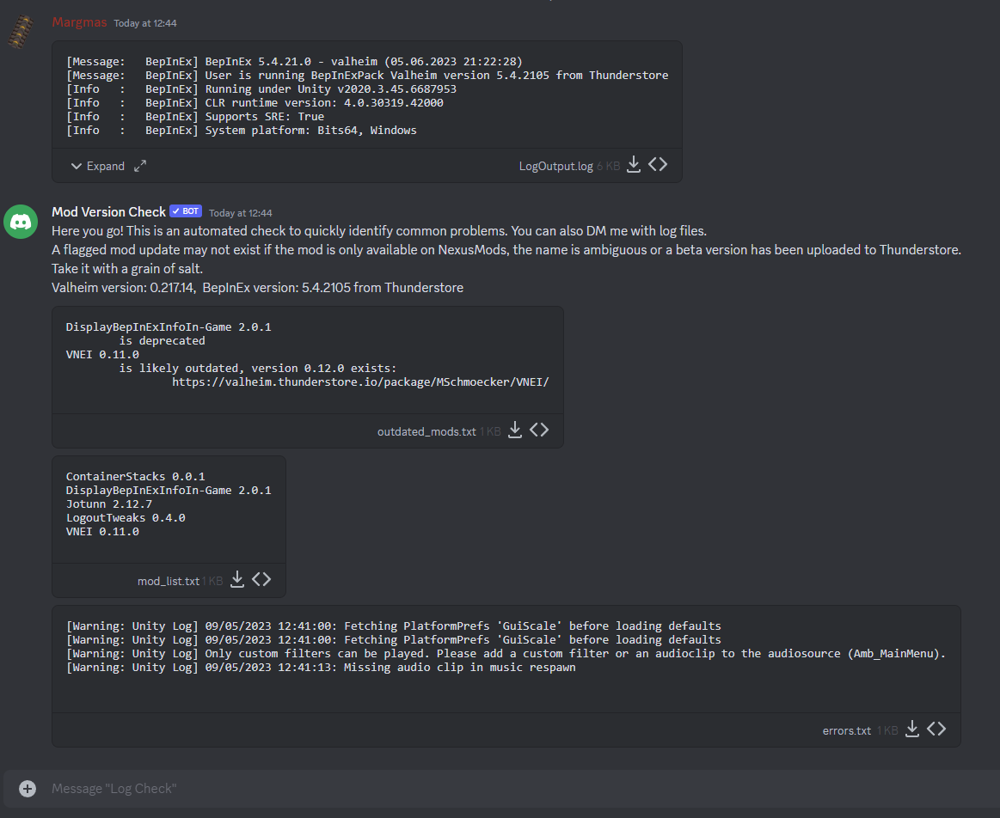

# Valheim Mod Version Check

## About
A ~~simple~~ over-engineered discord bot that reads mod versions from a logfile and checks those against the Thunderstore API and the Nexus API.

## Quick Usage
Invite this bot to your server using this [link](https://discord.com/api/oauth2/authorize?client_id=972794598856474664&permissions=100352&scope=bot).\
The discord commands `!checkmods` and `!modlist` are added.
Reply to a message that contains a logfile with either of the commands.\
Use `!thunderstore mods [Mod_GUID]` to see all extracted mods the bot uses.



## Deploy Your Own Bot
If you want to host your own bot, the easiest way is to use docker-compose.

```yaml
version: "3.3"
services:
  app:
    image: maxschmoecker/valheim-mod-version-check:latest
    environment:
      - PYTHONUNBUFFERED=1
      - DISCORD_TOKEN={your-bot-token}
      - NEXUS_API_KEY={your-nexus-api-key}
      - DECOMPILE_THUNDERSTORE_MODS=false
    volumes:
      - ./data:/app/data/
```

## Development
- Copy `.env.sample` to `.env` and set necessary values.
- Run `docker-compose up --build` or `python app.py`


## Changelog
See [Changelog](CHANGELOG.md)
